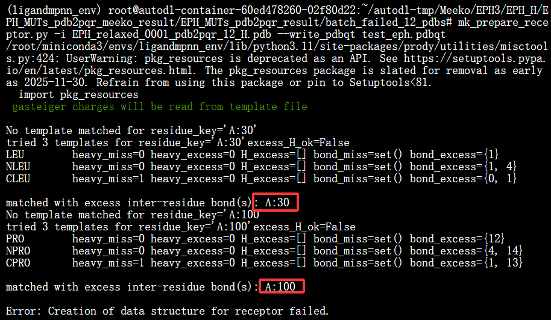
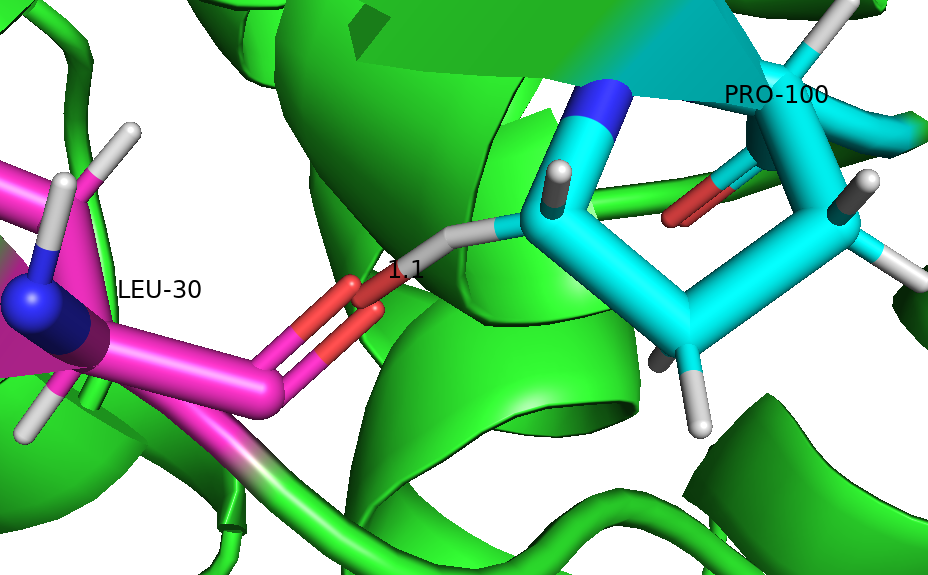
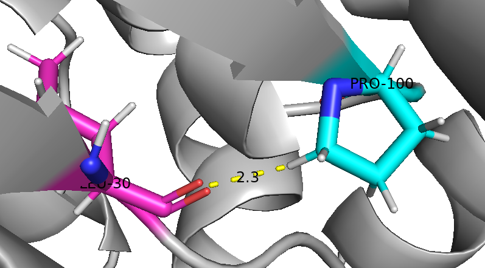
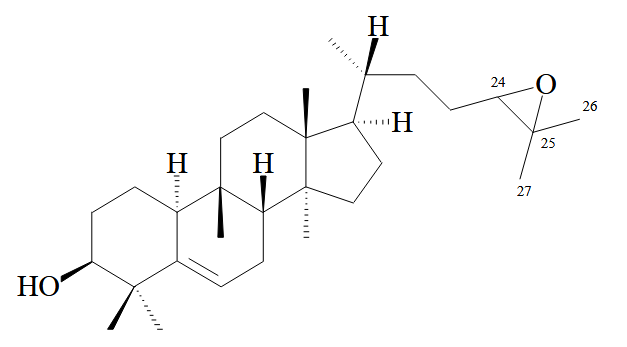
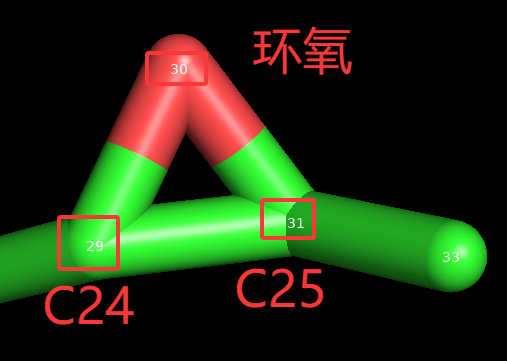

## 1. 质子化
---
**①pdb2pqr/propka**
[emoji](https://gist.github.com/rxaviers/7360908)
[文档](https://pdb2pqr.readthedocs.io/en/latest/):memo:
[github](https://github.com/Electrostatics/pdb2pqr):point_left:

```bash
ligand1:https://www.ebi.ac.uk/chebi/CHEBI:62456
老师给的(手性有问题): C/C(C)=C/CC[C@@H](C)C1CC[C@@]2(C)C3CC=C4C(C)(C)[C@@H](O)CCC4[C@]3(C)CC[C@@]21C
3D:结构pubchem:14543446：https://pubchem.ncbi.nlm.nih.gov/compound/Cucurbitadienol#section=3D-Conformer

ligand2(P450环氧):https://www.ebi.ac.uk/chebi/CHEBI:229949
老师给的(手性有问题): C[C@H](CCC1C(C)(C)O1)C2CC[C@@]3(C)C4CC=C5C(C)(C)[C@@H](O)CCC5[C@]4(C)CC[C@@]32C
3D:结构：https://pubchem.ncbi.nlm.nih.gov/compound/171037431#section=3D-Conformer

ligand3:(24,25-dihydroxy-cucurbitadienol) (水解-OH):https://pubchemlite.lcsb.uni.lu/e/compound/171037432
3D结构：https://pubchem.ncbi.nlm.nih.gov/compound/171037432#section=3D-Conformer

# pubchem/chebi官方ligands结构
ligand1 = "[H][C@@]12CC=C3C(C)(C)[C@@H](O)CC[C@@]3([H])[C@]1(C)CC[C@@]1(C)[C@@]2(C)CC[C@]1([H])[C@H](C)CCC=C(C)C"
ligand2 = "[H][C@@]12CC=C3C(C)(C)[C@@H](O)CC[C@@]3([H])[C@]1(C)CC[C@@]1(C)[C@@]2(C)CC[C@]1([H])[C@H](C)CC[C@@H]1OC1(C)C"
ligand3 = "C[C@H](CC[C@H](C(C)(C)O)O)[C@H]1CC[C@@]2([C@@]1(CC[C@@]3([C@H]2CC=C4[C@H]3CC[C@@H](C4(C)C)O)C)C)C"
```
**②propka指令**
```bash
propka3 EPH.pdb -o 7.0
```
- **EPH.pdb**：要预测Pka的pdb文件
- **-o**：PH 

**③pdb2pqr指令**
```bash
pdb2pqr --ff=AMBER --titration-state-method=propka --with-ph=7.0 --pdb-output=EPH_input_for_rosetta.pdb EPH.pdb EPH.pqr
```
- **--ff=AMBER**：力场算法
- **--titration-state-method=propka**：Propka做Pka预测
- **--with-ph=7.0**：PH7
- **--pdb-output=EPH_input_for_rosetta.pdb**：默认不输出pdb这里指定
- **EPH.pdb**：输出文件pdb (参数必须)
- **EPH.pqr**：输出的pqr添加缺失的重原子，优化氢键，使用力场如AMBER或CHARMM分配电荷和半径(参数必须)


## 2. 详细步骤
**①先做WT的Fastrelax**
- 至于为什么可以看**3**小节，WT做多库的能量最小化，MUT可以减少迭代次数
- 先对AF3或其他结构预测模型的**EPH.pdb**结果做**Fastrelax**，优化侧链可能存在的clash
- 结果：**EPH_relaxed_0001.pdb**
```bash
#!/bin/bash
/root/autodl-tmp/rosetta.binary.ubuntu.release-408/main/source/bin/relax.static.linuxgccrelease \
    -database /root/autodl-tmp/rosetta.binary.ubuntu.release-408/main/database \
    -s EPH.pdb \
    -in:file:fullatom \
    -use_input_sc \
    -relax:fast \
    -ignore_unrecognized_res \
    -relax:ramp_constraints false \
    -relax:constrain_relax_to_start_coords \
    -relax:coord_constrain_sidechains \
    -ex1 -ex2 \
    -linmem_ig 10 \
    -nstruct 5 \
    -out:suffix _relaxed
```
**②做pdb2pqr质子化**
- 对Fastrelax结果**sc**文件找能量最低的pdb文件:**EPH_relaxed_0001.pdb**
- 结果:**EPH_relaxed_0001_pdb2pqr.pdb**
- HIS 295质子化带正电荷
```bash
# 先对AF3结果的EPH结构Fastrelax在pdb2pqr指令
pdb2pqr --ff=AMBER --titration-state-method=propka --with-ph=7.0 --pdb-output=EPH_relaxed_0001_pdb2pqr.pdb EPH_relaxed_0001.pdb EPH_relaxed_0001.pqr
```
**③做Meeko转pdbqt**
```bash
mk_prepare_ligand.py -i EPH_relaxed_0001_pdb2pqr.pdb -o EPH_relaxed_0001_pdb2pqr.pdbqt
```
- 结果:**EPH_relaxed_0001_pdb2pqr.pdbqt**
- 可以计算HIS295总电荷为+1

**④vina/chai-1/AF3/boltz2分子对接找构象**
- 催化三联体:101ASP 295HIS 260ASP
- 阳阴离子洞:150Tyr & 230Tyr  二者到环氧氧距离3.0
- 核心motif:HGFP--H31-G32-F33-P34(定位催化水)
- **pdbqt文件准备**:Fastrelax->pdb2pqr->meeko
```bash
'''
1. vina找NAC构象指令
''' 

# 以101ASP的OD2为盒子中心
vina.exe --receptor EPH_relaxed_0001_pdb2pqr.pdbqt --ligand ligand2_Conformer3D_COMPOUND_CID_171037431.pdbqt --center_x -2.638 --center_y 5.770 --center_z -0.390 --size_x 25 --size_y 25 --size_z 25 --cpu 6 --num_modes 40 --energy_range 100 --exhaustiveness 64 --out "result_vina\EPH_ligand2.pdbqt" > "result_vina\EPH_ligand2_score.txt"

# 三点质心为盒子中心：-2.725, 7.632, -2.866✅️101asp 150tyr 230tyr
vina.exe --receptor EPH_relaxed_0001_pdb2pqr.pdbqt --ligand ligand2_Conformer3D_COMPOUND_CID_171037431.pdbqt --center_x -2.725 --center_y 7.632 --center_z -2.866 --size_x 25 --size_y 25 --size_z 25 --cpu 6 --num_modes 40 --energy_range 100 --exhaustiveness 64 --out "result_vina\EPH_ligand2.pdbqt" > "result_vina\EPH_ligand2_score.txt"

# 找合适的构象在pymol中保存
# 对vina的对接结果找几何距离满足的构象保存 同下
save ligand2_pose12.sdf, EPH_ligand2, state=12
save ligand2_pose13.sdf, EPH_ligand2, state=13

# 对接产物ligand3--质心
vina.exe --receptor EPH_relaxed_0001_pdb2pqr.pdbqt --ligand ligand3_Conformer3D_COMPOUND_CID_171037432.pdbqt --center_x -2.725 --center_y 7.632 --center_z -2.866 --size_x 25 --size_y 25 --size_z 25 --cpu 6 --num_modes 40 --energy_range 100 --exhaustiveness 64 --out "vina_result_ligand3\EPH_ligand3.pdbqt" > "vina_result_ligand3\EPH_ligand3_score.txt"
# 对vina的对接结果找几何距离满足的构象保存，这里面没氢，所以直接对vina pdbqt结果文件直接提取pose
save ligand3_pose8.sdf, EPH_ligand3, state=8
save ligand3_pose15.sdf, EPH_ligand3, state=15

'''
2. vina结果pdbqt文件提取单个pose
    ubuntu中的ligand_pose文件夹
''' 
# ligand3_pose8
# 找到 MODEL N 的行号
grep -n "^MODEL 8" EPH_ligand3_8and15.pdbqt    # 起始行:470:MODEL 8
grep -n "^ENDMDL" EPH_ligand3_8and15.pdbqt | head -8  # 前8个ENDMDL结束的行 第8个ENDMDL就是我们要的结束行67:ENDMDL
134:ENDMDL
201:ENDMDL
268:ENDMDL
335:ENDMDL
402:ENDMDL
469:ENDMDL
536:ENDMDL
# 提取：同下
sed -n '470,536p' EPH_ligand3_8and15.pdbqt > ligand3_pose8.pdbqt

# ligand2_pose12
grep -n "^MODEL 12" EPH_ligand2_12and13.pdbqt 
639:MODEL 12
grep -n "^ENDMDL" EPH_ligand2_12and13.pdbqt | head -12
58:ENDMDL
116:ENDMDL
174:ENDMDL
232:ENDMDL
290:ENDMDL
348:ENDMDL
406:ENDMDL
464:ENDMDL
522:ENDMDL
580:ENDMDL
638:ENDMDL
696:ENDMDL
# 提取：470,536 = 行号范围第470行到第536行；p = print 打印这些行
sed -n '639,696p' EPH_ligand2_12and13.pdbqt > ligand2_pose12.pdbqt

'''
3. pymol基础指令
''' 

# 显示ligand的原子名字
label ligand2_pose12, name

# 显示ligand的原子index(这里显示的是pymol的方法27 28，实际文献标注是24 25)
label ligand2_pose12, index

# 显示单个残基的原子名字
label EPH_relaxed_0001_pdb2pqr and resi 101, name

# 每个原子的**名称（比如 OD1, OD2）和对应的 PDB 原子序号（ID）
label resi 101, "%s (ID:%s)" % (name, ID)
label resi 101, name

# 打印原子坐标和序号，注意氢导致序号和pdb有出入
iterate_state 1, resi 101 and name OD1, print("Atomic Index: %s | Coordinates: X=%.3f, Y=%.3f, Z=%.3f" % (ID, x, y, z))

# 精简写法打印坐标
iterate_state 1, resi 101 and name OD1, print("Coordinates: X=%.3f, Y=%.3f, Z=%.3f" % (x, y, z))

# 关闭化合价显示
set valence, off
```
- ASP的OD2到C24 C25距离<3.5, 两个Tyr的-OH到环氧距离
- 角度:攻击环氧背面的C24 25
- NAC构象朝向问题-是出口还是入口

⑤CAVER通道
出发点ASP101坐标，蛋白EPH.pdb

```bash
# 找ligand5A范围残基
# 方式2 这个sele加不加括号都一样
temp=[];iterate (ligand5A_resides) and name CA, temp.append(resn+resi)
print(",".join(temp))
```
⑥foldx突变
> meeko报错情况:残基原子距离太近，导致非必要的残基相连致使meeko模版识别不了，核心还是要优化clash



> 30的O原子和100的H原子距离1.1(就算是C和O的距离也是2.0优化后3.1)太近导致clash需要Fastrelax



> fastrelax之后(重复优化2轮生成1个结果pdb)


```bash
# 先做Repair
..\foldx --command=PrepairPDB --pdb=EPH_relaxed_0001_pdb2pqr.pdb
# 对relax和质子化的pdb做突变结构
..\foldx --command=BuildModel --pdb=EPH_relaxed_0001_pdb2pqr.pdb --mutant-file=individual_list.txt
# repair前后(对Fastrelax的结构做不做Repair)做buildmodel的ddG结果：基本没有影响(测试已经失败的就是有clash且meeko转换失败)
# 结论：即使做了Repair再对这些失败的突变重新在Repair的基础上做buildmodel，基本无影响；即使再对MUT做Repair还是会有一部分转换失败，所以对foldx的突变结构需要做Fastrelax，最彻底最根本！
HA100P;6.59812;6.59954
AA104E;16.5016;15.5378
AA104Q;15.1697;15.5286
AA104W;57.5803;58.3826
AA104Y;43.0292;40.8371
SA125H;15.9723;18.0714
SA125P;6.30073;5.20668
VA126F;1.45903;-0.365622
FA154P;4.0863;3.47979
LA172P;7.33239;7.82931
TA175P;4.99328;4.4751
SA176P;4.62825;4.72653

# MUTs的Fastrelax指令
/root/autodl-tmp/rosetta.binary.ubuntu.release-408/main/source/bin/relax.static.linuxgccrelease \
    -database /root/autodl-tmp/rosetta.binary.ubuntu.release-408/main/database \
    -s EPH_relaxed_0001_pdb2pqr_12_H.pdb \
    -ignore_unrecognized_res \
    -in:file:fullatom \
    -relax:fast \
    -relax:default_repeats 2 \
    -relax:ramp_constraints false \
    -relax:constrain_relax_to_start_coords \
    -relax:coord_constrain_sidechains \
    -nstruct 1 \
    -out:suffix _r5

# foldx的结果文件中有foldx开头的行所有需要批量去掉
下面就是foldx输出的前3行
'''
FoldX generated pdb file

Output generated by <BuildModel>
'''

# foldx结果中去掉了所有氢，所以还需要MUTs质子化，然后再meeko
# 1. 批量质子化(问题:foldx结果文件有3行非标准输出，需要处理去掉)
# 批量--到418 pdb所在文件夹下运行
#!/bin/bash
for file in *.pdb; do 
    # 自动检测并清理FoldX的前三行
    if head -n 1 "$file" | grep -q "FoldX"; then
        sed -i '1,3d' "$file"
        echo "已清理头部: $file"
    fi
    # 提取前缀并进行质子化
    base="${file%.pdb}"
    echo "正在处理质子化: $file"
    pdb2pqr --ff=AMBER \
            --titration-state-method=propka \
            --with-ph=7.0 \
            --pdb-output="EPH_MUTs_pdb2pqr_result/${base}_H.pdb" \
            "$file" \
            "EPH_MUTs_pdb2pqr_result/${base}.pqr"
done 
echo "所有文件批量质子化完成！已存入 EPH_MUTs_pdb2pqr_result 文件夹"
# 统计文件
ls *.pdb | wc -l

# 2. 批量meeko(问题就是folx一开始就没有最后一列的原子名称，这时候meeko会报错，所以还需要再pdb2pqr结果文件中处理元素:batch_atom.py文件处理)
#!/bin/bash
# 先创建好结果文件meeko_result
# mkdir -p meeko_result
for file in *_H.pdb; do
    base="${file%_H.pdb}";
    echo "正在使用Meeko处理: $file";
    mk_prepare_receptor.py -i "$file" --write_pdbqt "meeko_result/${base}.pdbqt";
done;
echo "全部转换完成！存放在meeko_result文件夹中"

# 3.meeko转换的结果中有12个存在原子冲突或额外的化学键，由于foldx突变的时候残基侧链原子间距离太近导致不该有的化学键
# 3.1 找到12个文件
echo "正在比对文件，以下是未成功生成 pdbqt 的 12 个文件："
for file in *_H.pdb; do
    base="${file%_H.pdb}"
    # 检查 meeko_result 文件夹里有没有对应的 pdbqt 文件
    if [ ! -f "meeko_result/${base}.pdbqt" ]; then
        echo "$file"
        # 顺便把这12个坏文件复制到一个单独的文件夹方便观察
        mkdir -p batch_failed_12_pdbs
        cp "$file" batch_failed_12_pdbs/
    fi
done
echo "检查完毕！这12个源文件已复制到failed_12_pdbs/文件夹中"

# 3.2 测试单个文件的meeko转换的详细问题原子间距离太近；直接舍弃这几个12个
# 3.3 也可以按照foldx的ddg筛选掉一批，目前暂且舍弃那12个，转换成功的做对接

```
⑦ vina对接
```bash
# 4. vina对接(mac上做的):见vina.sh
#!/bin/zsh
# Vina 执行程序路径
VINA_BIN="/Users/hence/workspace/autodock_vina_1_1_2_mac_catalina_64bit/bin/vina"
# 固定的配体文件路径 
LIGAND="/Users/hence/workspace/mac_vina/ligand2_pose12.pdbqt" 
# 存放所有突变体受体(pdbqt格式)的目录
RECEPTOR_DIR="/Users/hence/workspace/mac_vina/meeko_result"
# 存放对接结果的输出目录
OUT_DIR="/Users/hence/workspace/mac_vina/vina_result"
echo "开始批量对接 (不同突变体 -> 同一个配体)..."
echo "配体文件: $LIGAND"
echo "受体目录: $RECEPTOR_DIR"
# 找到 RECEPTOR_DIR 目录下所有的 .pdbqt 文件
for RECEPTOR in "$RECEPTOR_DIR"/*.pdbqt; do
    # 提取突变体受体的纯文件名
    BASENAME=$(basename "$RECEPTOR" .pdbqt)
    echo "[$(date +'%H:%M:%S')] 正在对接突变体: $BASENAME ..."
    # 执行 Vina 对接指令
    $VINA_BIN \
        --receptor "$RECEPTOR" \
        --ligand "$LIGAND" \
        --center_x -2.725 --center_y 7.632 --center_z -2.866 \
        --size_x 25 --size_y 25 --size_z 25 \
        --cpu 9 --num_modes 20 --energy_range 10 --exhaustiveness 64 \
        --out "$OUT_DIR/${BASENAME}_out.pdbqt" \
        > "$OUT_DIR/${BASENAME}_score.txt"
done
echo "所有突变体对接任务已完成！"
```

⑧最终筛选
```bash
筛选标准：
ASP101-C24/C25几何距离<3.5A
Tyr150/Tyr230-OH到环氧距离<3.0A
# pymol对out.pdbqt对接结果找C24 C25结果
# PyMOL中的ID与PDB文件中ATOM记录的原子序号保持一致
```

`显示原子ID:label EPH_relaxed_0001_pdb2pqr_1_out, ID`

`看坐标(1就是第一个构象):PyMOL>iterate_state 1, ID 29, print(x,y,z)
-0.17800000309944153 20.19099998474121 0.4129999876022339`
`pdbqt文件中: ATOM     29  C   UNL     1      -0.178  20.191   0.413  1.00  0.00     0.150 C 
`
### :memo:结果：C24-->ATOM29 C25-->ATOM31 O-->ATOM30
---


## 3. Rosetta--Fastrelax模块测试

指令集合：https://docs.rosettacommons.org/manuals/archive/rosetta_2016.28.58794_user_guide/all_else/d9/de0/md_src_basic_options_full-options-list.html

---

```bash
#!/bin/bash
/root/autodl-tmp/rosetta.binary.ubuntu.release-408/main/source/bin/relax.static.linuxgccrelease \
    -database /root/autodl-tmp/rosetta.binary.ubuntu.release-408/main/database \
    -s EPH_input_for_rosetta.pdb \
    -in:file:fullatom \
    -use_input_sc \
    -relax:fast \
    -ignore_unrecognized_res \
    -relax:ramp_constraints false \
    -relax:constrain_relax_to_start_coords \
    -relax:coord_constrain_sidechains \
    -ex1 -ex2 \
    -linmem_ig 10 \
    -nstruct 5 \
    -out:suffix _relaxed \
    -out:file:scorefile score_rawAF3_relaxed.sc \
```

**①先pdb2pqr再Fastrelax**❌️
最终的
```bash
core.io.pose_from_sfr.PoseFromSFRBuilder: [ WARNING ] discarding 1 atoms at position 17 in file EPH_input_for_rosetta.pdb. Best match rsd_type:  HIS
core.io.pose_from_sfr.PoseFromSFRBuilder: [ WARNING ] discarding 1 atoms at position 100 in file EPH_input_for_rosetta.pdb. Best match rsd_type:  HIS
core.io.pose_from_sfr.PoseFromSFRBuilder: [ WARNING ] discarding 1 atoms at position 295 in file EPH_input_for_rosetta.pdb. Best match rsd_type:  HIS
...
抛弃了EPH_input_for_rosetta.pdb中第 17、100、295号位置上的各1个原子,因为它最匹配的残基类型是标准HIS
Rosetta读取结构时，依然只看了文字缩写标签HIS，而默认地把PDB2PQR给His295、His100额外加的那第2个极性质子HD1/HE2当成了非标准多余杂原子，给直接无情抛弃了

pdbqt文件中电荷总量
0.242
-0.272
0.177
-0.343
0.090
0.037
-0.347
0.134
0.167
0.196
-0.245
0.164
===0
```


**②先Fastrelax再pdb2pqr**✅️
最终结果
```bash
有质子HD1 HE2
0.242
-0.273
0.179
-0.343
0.119
0.142
-0.248
0.244
0.312
0.400
-0.250
0.312
0.164
===1.00 对应Pka中的10.85

```
**③换参数**
和①一样的结果，rosetta还是会忽略❌️
```bash
#!/bin/bash
/root/autodl-tmp/rosetta.binary.ubuntu.release-408/main/source/bin/relax.static.linuxgccrelease \
    -database /root/autodl-tmp/rosetta.binary.ubuntu.release-408/main/database \
    -s EPH_input_for_rosetta.pdb \
    -in:file:fullatom \
    -use_input_sc \
    -relax:fast \
    -ignore_unrecognized_res \
    -relax:ramp_constraints false \
    -relax:constrain_relax_to_start_coords \
    -relax:coord_constrain_sidechains \
    -pH:pH_mode true \
    -pH:value_pH 7.0 \
    -keep_input_protonation_state true \
    -ex1 -ex2 \
    -linmem_ig 10 \
    -nstruct 5 \
    -out:suffix _protonation \
    -out:file:scorefile score_protonation.sc \

```


